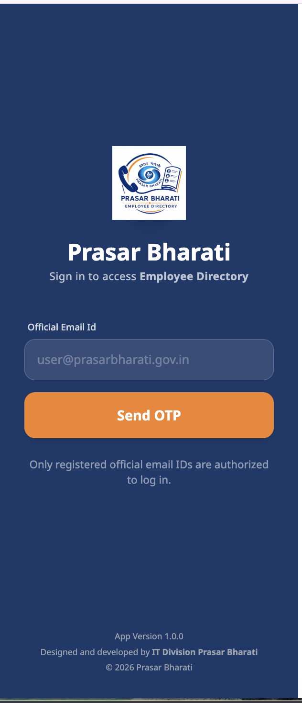
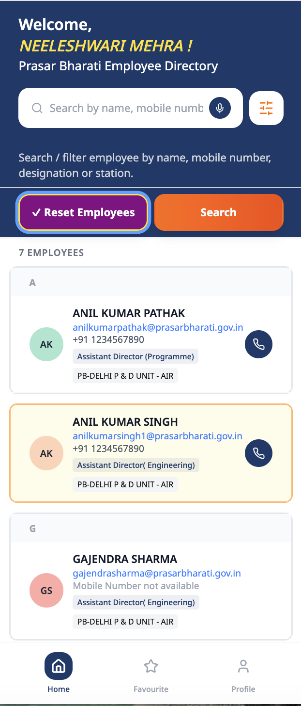
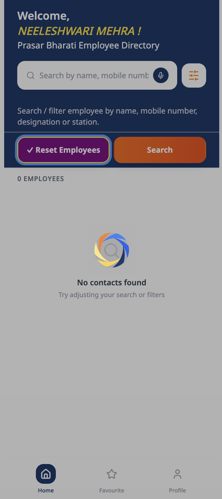
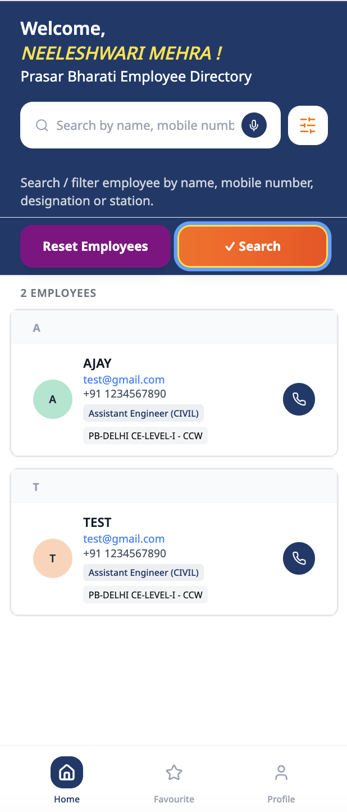
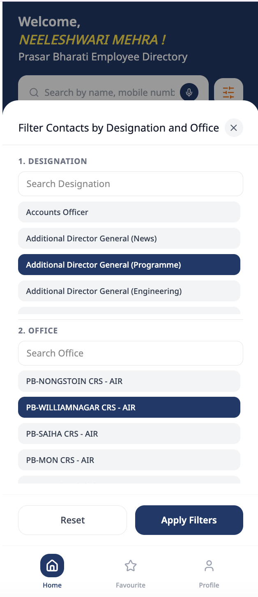
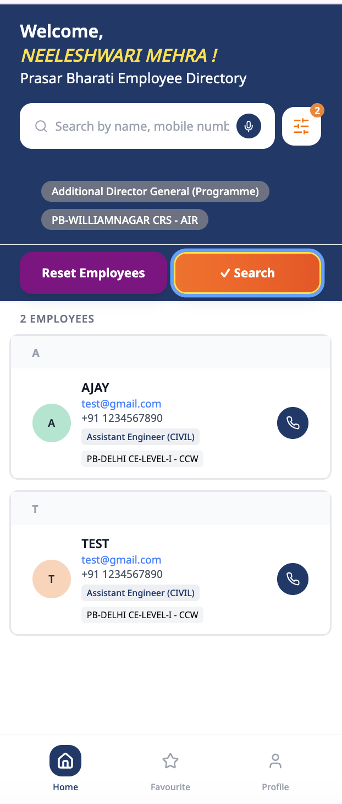
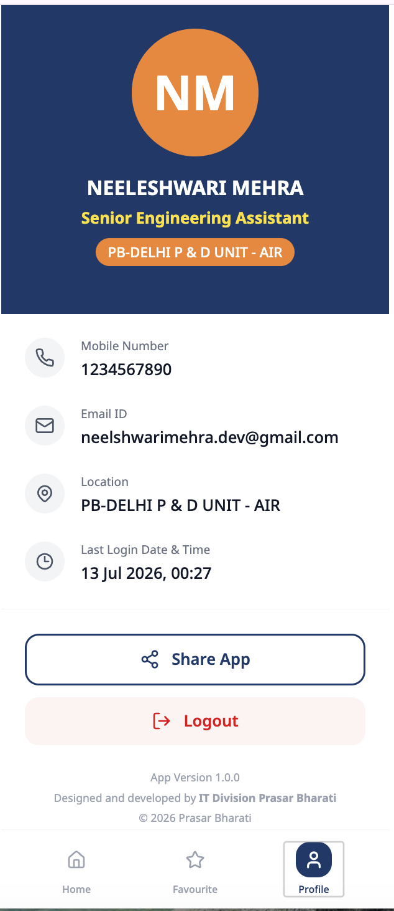
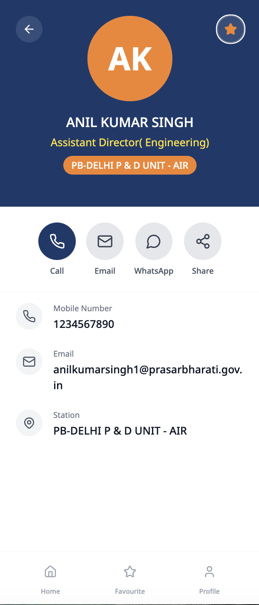
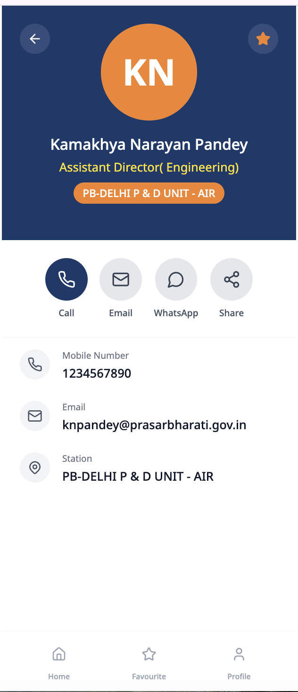

# 📞 Prasar Bharati Employee Directory

A secure employee directory application built with **React**, **Ionic React**, and **Capacitor** for Prasar Bharati employees. The application provides OTP-based authentication, employee contact search, favorites management, and offline support with a modern, responsive user interface.

---

## 📱 Features

* 🔐 OTP-based secure login
* 👤 Employee profile management
* 📇 Employee directory with search functionality
* ⭐ Add and remove favorite contacts
* 📞 One-tap phone calling
* 📧 Email integration
* ❤️ Favorite contacts stored locally
* 🔍 Fast employee search
* 🌙 Clean and responsive user interface
* 📱 Android mobile support using Capacitor
* 💾 Local storage for user preferences and session management
* 🔄 Automatic login session management
* 📡 REST API integration
* ⚠️ Offline/No Internet detection screen

---

## 📸 Screenshots

## Screenshot
<p align="center">
  
  
  
  
  
  
  
  
  
  
  
</p>

```text
screenshots/
├── login.png
├── otp.png
├── home.png
├── search.png
├── favourites.png
└── profile.png
```

Example:

```markdown
## Login


## Employee Directory


## Favorites


```

---

## 🛠️ Tech Stack

### Frontend

* React
* Ionic React
* TypeScript / JavaScript
* React Router
* Tailwind CSS
* Bootstrap

### Mobile

* Capacitor
* Android

### State Management

* Zustand

### Storage

* Capacitor Preferences

### Networking

* Axios
* REST API

---

## 📂 Project Structure

```text
src/
│
├── components/
├── pages/
├── services/
├── hooks/
├── store/
├── utils/
├── assets/
├── routes/
├── context/
└── App.tsx
```

---

## 🚀 Getting Started

### Clone the repository

```bash
git clone https://github.com/your-username/prasar-bharati-directory.git
```

### Install dependencies

```bash
npm install
```

### Start the development server

```bash
npm start
```

or

```bash
ionic serve
```

---

## 📱 Android

Build the application

```bash
npm run build
```

Sync Capacitor

```bash
npx cap sync android
```

Open Android Studio

```bash
npx cap open android
```

---

## ✨ Main Modules

* Authentication
* OTP Verification
* Employee Directory
* Employee Search
* Favorites
* User Profile
* Session Management
* Offline Support

---

## 🔒 Security

* OTP authentication
* Secure API communication
* Token-based session management
* Automatic session expiry
* Local data stored securely using Capacitor Preferences

---

## 🎯 Future Improvements

* Push Notifications
* Dark Mode
* QR Code Contact Sharing
* Voice Search
* Department Filters
* Contact Export
* Employee Photo Support
* Multi-language Support

---

## 👩‍💻 Author

**Neeleshwari Mehra**

* Mobile Application Developer
* React Developer
* Ionic React Developer

---

## 📄 License

This project is intended for educational and portfolio purposes. Organizational branding, APIs, and data belong to their respective owners.


# Mobile PB Employee Directory App
This is a code bundle for Mobile PB Employee Directory App. 
## Running the code

Run `npm i` to install the dependencies.

Run `npm run dev` to start the development server.
